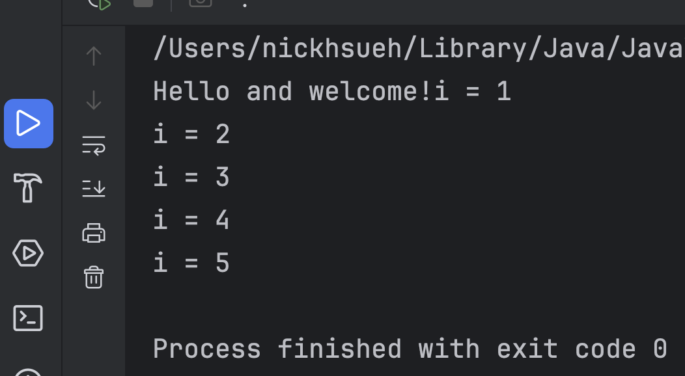

# H1 Report

* Name: 
* ID:

---

## 題目：這只是一個 Sample

## 設計方法概述
先印出 Hello world, 在透過 Java 的迴圈，一共跑五次，每一次都印出提示字和 i 的值。

## 程式、執行畫面及其說明
迴圈的內容如下：

```java
for (int i = 1; i <= 5; i++) {
    System.out.println("i = " + i);
}
```

每一次，i 的值會變化。執行的畫面如下：



# AI 使用狀況與心得

這個展示比較容易，所以沒有用到 AI

## 心得
我學到的迴圈的使用。